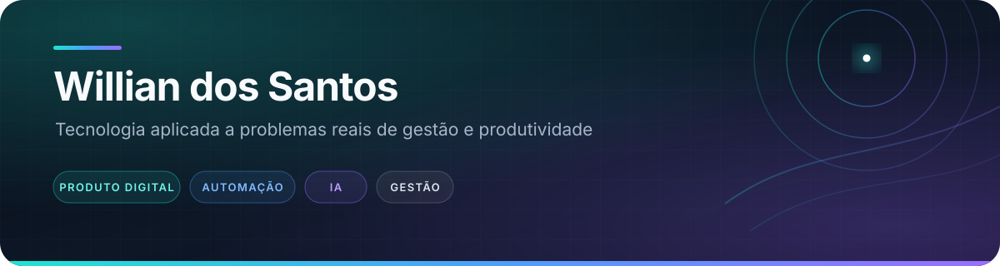

 

### Desenvolvimento de soluções digitais para gestão, produtividade e educação

Transformo problemas de operação em aplicações práticas, combinando **desenvolvimento**, **automação**, **inteligência artificial** e **visão de negócio**.

 

 

## 👋 Sobre mim

Sou formado em **Análise e Desenvolvimento de Sistemas** e estudante de **Administração**. Minha atuação conecta tecnologia e negócios para criar produtos digitais úteis, claros e aplicáveis a situações reais.

Tenho interesse especial em:

- sistemas e automações para rotinas administrativas;
- inteligência artificial aplicada a produtos e processos;
- experiências digitais acessíveis e bem organizadas;
- educação prática baseada em projetos;
- soluções para produtividade, dados e tomada de decisão.

 

## ✦ Projetos em destaque

<table>
  <tr>
    <td width="50%" valign="top">
      
        
      Trilha aberta de <strong>Administração Digital, Automação e IA</strong>, organizada em módulos e projetos práticos.
        
      <strong>Destaques:</strong> documentação educacional, mapa visual, contribuição aberta e licença livre.
    </td>
    <td width="50%" valign="top">
      
        
      Aplicação <strong>offline-first</strong> para motoristas e entregadores acompanharem ganhos, custos e manutenção do veículo.
        
      <strong>Stack:</strong> React, Vite, Tailwind CSS, Dexie.js e Capacitor.
    </td>
  </tr>
  <tr>
    <td width="50%" valign="top">
      
        
      Biblioteca inteligente para <strong>salvar, resumir e organizar</strong> links, artigos, vídeos e arquivos.
        
      <strong>Stack:</strong> React, TypeScript, Fastify, Zod e Vitest.
    </td>
    <td width="50%" valign="top">
      
        
      Cockpit de produtividade que reúne <strong>foco, planejamento, metas, reflexão</strong> e assistência por IA.
        
      <strong>Stack:</strong> React, TypeScript e Vite.
    </td>
  </tr>
  <tr>
    <td width="50%" valign="top">
      
        
      Automação em Python que identifica inconsistências em planilhas e gera <strong>relatórios de qualidade e auditoria</strong>.
        
      <strong>Stack:</strong> Python e openpyxl.
    </td>
    <td width="50%" valign="top">
      
        
      Aplicação de notas com <strong>transcrição de áudio, leitura de documentos</strong> e ferramentas de análise por IA.
        
      <strong>Stack:</strong> React, TypeScript, Vite e APIs de IA.
    </td>
  </tr>
</table>

 

## ◈ Tecnologias principais

### Desenvolvimento

### Interface e ferramentas

 

## ⬡ Como trabalho

<table>
  <tr>
    <td width="20%" align="center"><strong>01</strong> Entender</td>
    <td width="20%" align="center"><strong>02</strong> Planejar</td>
    <td width="20%" align="center"><strong>03</strong> Construir</td>
    <td width="20%" align="center"><strong>04</strong> Documentar</td>
    <td width="20%" align="center"><strong>05</strong> Evoluir</td>
  </tr>
</table>

1. Entendo o problema e o público antes de escolher a tecnologia.
2. Organizo o produto em uma primeira versão pequena e verificável.
3. Documento decisões, limitações e próximos passos.
4. Uso automação e IA como apoio, mantendo clareza sobre o que o sistema realmente faz.
5. Evoluo os projetos com base em testes, aprendizado e uso prático.

 

## ↗ Atualmente

- aprofundando React, TypeScript, Node.js e Python;
- estudando Administração e aplicação de tecnologia em processos;
- construindo produtos nas áreas de produtividade, educação e gestão;
- melhorando documentação, testes e publicação dos projetos.

 

## Vamos nos conectar

Tecnologia faz mais sentido quando resolve problemas reais e aproxima pessoas.

 

 

Desenvolvendo soluções na interseção entre tecnologia, gestão e inteligência artificial.

